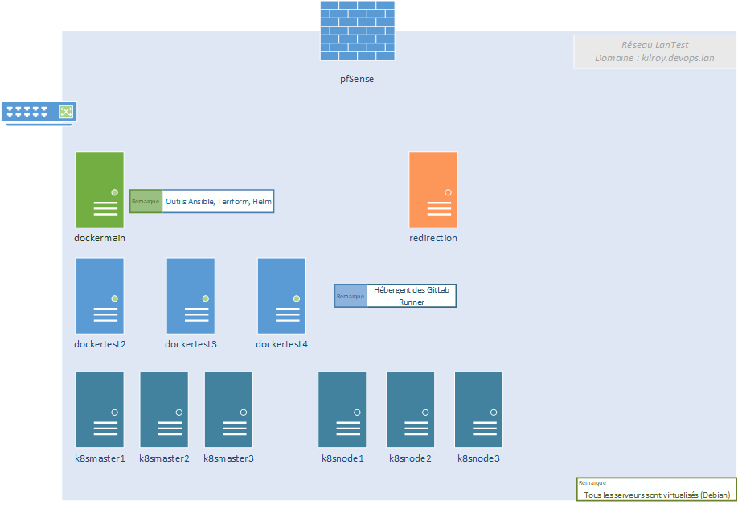
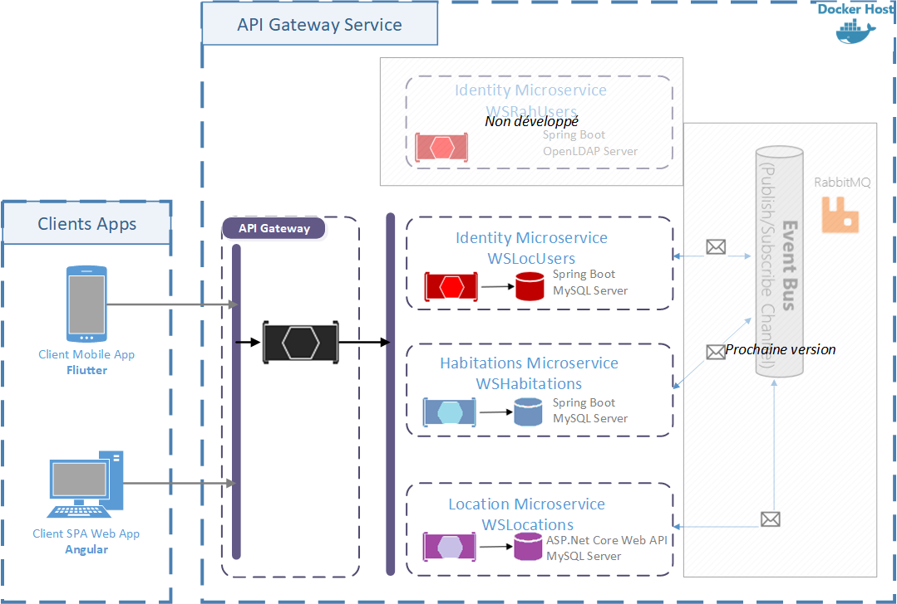

# Le projet Rent A House
## Présentation
Le projet est né d'une idée simple : je devais faire un TD pour le cours mobile des 3ème année en Flutter.
Dans le cadre du TD, les données sont codées en dur dans l'application.

Je suis parti de ce TD pour réaliser une architecture complète intégrant le développement des applications et 
le déploiement de celles-ci.

Cette page présente l'architecture réseau/système et l'architecture logicielle.

Le projet est présenté  [ici](projet/presentation.md)

## L'architecture système/réseau
### Physique
L'architecture utilisée est minimale, car il s'agit d'un laboratoire de test.
Elle est composée de
- un accès Internet avec une FreeBox (configurée en bridge)
- un serveur VMware ESXi 6.5 (sur Dell PowerEdge R540), la configuration physique du serveur ne permet pas d'installer une version supérieure.

### Virtualisée

#### Les serveurs docker*xxx*
dockermain héberge les containers de l'architecture : DNS, Bases de données, outil Ansible

dockertest*x* héberge les runners pour Gitlab : Gradle, Flutter, Dotnet et Kubernetes

#### Les servers k8s
Ils hébergent un environement Kubernetes baremetal :
- 3 serveurs maîtres
- 3 serveurs noeuds

#### Le serveur redirection
Ce serveur héberge le service nginx proxy pour les accès aux API.
> [!NOTE]
> Ce serveur doit être dupliqué pour la redondance avec l'ajout d'un service keepalived.

### Logique

Le serveur redirection a le service iptables.

Le serveur dockermain a les containers suivants :
- DNS - bind9
- Reverse-proxy : nginx
- Annuaire - OpenLDAP

kubernetes a les containers suivants :
- WSLocUsers : gestion des clients
- WSHabitations : gestion des biens
- WSLocations : gestion des locations
- ApiGateway : point d'entrée des clients
- Ingress-nginx (Helm ingress-nginx/ingress-nginx)
- Prometheus Cluster (Helm prometheus-community/kube-prometheus-stack)
- RabbitMQ Cluster (Helm bitnami/rabbitmq-cluster-operator)

## L'architecture logicielle

Le projet Rent A House
- a pour client
  - Une application mobile Flutter 3.13
  - Une application web Angular 15.2 LTS
- a des microservices développés 
  - en Spring Boot 2.7 et 3.1 avec JPA, JWT, OpenAPI, mise en place de actuator (métriques pour Prometheus)
  - en ASP.Net Core Web API 6.0 avec Entity Framework, JWT, OpenAPI, métrique pour prometheus

