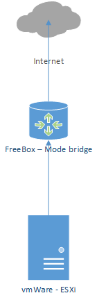

# Le projet Rent A House
## Présentation
Le projet est né d'une idée simple : je devais faire un TD pour le cours mobile des 3ème année en Flutter.
Dans le cadre du TD, les données sont codées en dur dans l'application.

Je suis parti de ce TD pour réaliser une architecture complète intégrant le développement des applications et 
le déploiement de celles-ci.

Cette page présente l'architecture réseau/système et l'architecture logicielle.

Le projet est présenté  [ici](projet/presentation.md)

## L'architecture système/réseau
### Physique
L'architecture utilisée est minimaliste car il s'agit d'un laboratoire de test.

Les 2 serveurs vmwares sont sous ESXi 6.5 car la configuration physique des serveurs ne permet pas d'installer une version supérieure.

### Logique

#### Les serveurs docker*xxx*
dockermain héberge les containers de l'architecture : DNS, Bases de données, outil Ansible

dockertest*x* héberge les runners pour Gitlab : Gradle, Flutter, Dotnet et Kubernetes

#### Les servers k8s
Ils hébergent un environement Kubernetes baremetal :
- 3 serveurs maîtres
- 3 serveurs noeuds

#### Le serveur vCenter
Il permet de gérer les images vmware des 2 serveurs. Ce serveur va être désactivé (mi-septembre 2023) car je n'ai plus de licence (version 6.5)

#### Le serveur redirection
Ce serveur héberge le service nginx proxy pour les accès aux API.
> [!NOTE]
> Ce serveur doit être dupliqué pour la redondance avec l'ajout d'un service keepalived.

## L'architecture logicielle

